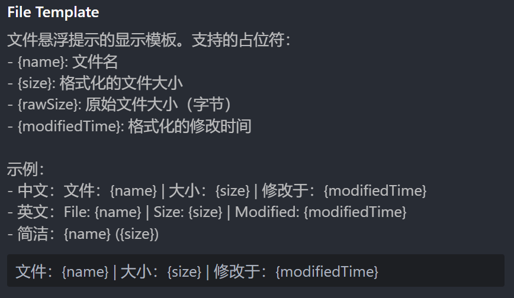
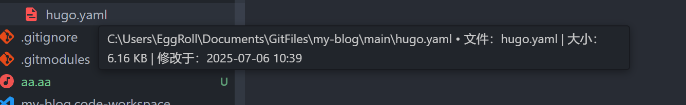
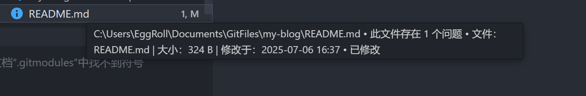

# Tree Enhancer | 文件树增强

🌲 一个增强 VS Code 资源管理器的扩展，在悬浮时显示文件和文件夹的详细信息。

🌲 An extension for enhancing the VS Code file explorer, showing detailed information about files and folders on hover.

## 重大升级 | Major Upgrade

现已支持自定义悬浮时显示的信息模板，也可以调整日期的格式，几乎全部设置增加了本地化功能（参见“贡献”）。请在 Tree Enhancer 的设置中查看相关配置项。

Now you can customize the hover display information template and adjust the date format. Almost all settings have been localized (see "Contributing"). Please check the relevant configuration items in the Tree Enhancer settings.




## 🐛 已知问题 | Bugs

- 当存在某些提示时，例如文件夹下的代码中有错误，这会导致文件夹提示“包含强调项”。该提示似乎有很高的优先级，会导致其他提示失效，包括 Git 状态和本扩展的提示。目前尚无法解决该问题。“包含强调项”被解决后，本扩展的提示将恢复正常。| When there are certain hints, such as errors in the code under a folder, it causes the folder to show "contains highlighted items". This hint seems to have a high priority and disables other hints, including Git status and this extension's hints. Currently, this issue cannot be resolved. Once the "contains highlighted items" hint is resolved, this extension's hints will return to normal.
- 高权限文件夹无法计算，这是预期之内的。| High-privilege folders cannot be calculated, which is expected.
- VS Code 的文件管理器似乎具有某种类似于缓存的机制，这有时会导致修改时间计算不准，这在 VS Code 自带的以“modified”排序文件的功能中似乎也存在，尚未定位问题的源头。 | The VS Code file manager seems to have some kind of caching mechanism, which sometimes leads to inaccurate modification time calculations. This issue also appears in VS Code's built-in feature for sorting files by "modified", and the source of the problem has not yet been identified.

## ✨ 主要功能 | Features

### 📁 智能文件夹信息 | Smart Folder Information

- **递归计算大小**：自动统计文件夹内所有文件的总大小
- **文件统计**：显示文件夹内的文件数量和子文件夹数量
- **实时计算**：每次悬浮都重新计算，确保信息准确性
- **超时保护**：可配置计算时间限制，避免长时间等待

- **Calculate Size Recursively**: Automatically calculates the total size of all files within the folder
- **File Count**: Displays the number of files and subfolders within the folder
- **Real-time Calculation**: Recalculates every time you hover to ensure accuracy
- **Timeout Protection**: Configurable time limit for calculations to avoid long waits

### 📄 详细文件信息 | Detailed File Information

- **文件大小**：以易读格式显示文件大小
- **修改时间**：显示文件最后修改时间
- **格式化显示**：中文友好的日期时间格式

- **File Size**: Displays file size in a human-readable format
- **Modification Time**: Shows the last modified time of the file
- **Formatted Display**: Friendly date and time format in Chinese

### ⚙️ 灵活配置 | Flexible Configuration

- **单位基底切换**：支持 1000（KB / MB / GB）和 1024（KiB / MiB / GiB）两种计算方式
- **超时设置**：可调节文件夹计算的最大等待时间（1 - 60秒）
- **调试模式**：开发者友好的详细日志输出

- **Unit Base Switching**: Supports both 1000 (KB / MB / GB) and 1024 (KiB / MiB / GiB) calculation methods
- **Timeout Settings**: Adjustable maximum wait time for folder calculations (1 - 60 seconds)
- **Debug Mode**: Developer-friendly detailed log output

## 📸 效果演示 | Effect Demonstration


👆 悬浮在文件夹上显示大小、文件数量、修改时间等信息 | Show size, number of files, modification time, etc. when hovering over a folder



👆 悬浮在文件上显示大小和修改时间 | Show size and modification time when hovering over a file



👆 与其他扩展的悬浮提示良好兼容 | Good compatibility with hover tips of other extensions

## 🚀 安装使用 | Install and Use

1. 在 VS Code 扩展市场搜索 "Tree Enhancer"
2. 点击安装并重启 VS Code
3. 将鼠标悬浮在资源管理器中的文件或文件夹上即可查看详细信息

-

1. Search for "Tree Enhancer" in the VS Code extension marketplace
2. Click Install and restart VS Code
3. Hover over files or folders in the explorer to view detailed information

## ⚙️ 扩展设置 | Extension Settings

本扩展提供以下配置选项：

This extension provides the following configuration options:

- `eggroll-tree-enhancer.maxCalculationTime`: 文件夹大小计算的最大等待时间（毫秒），默认 5000ms，范围 1000-60000 ms
- `eggroll-tree-enhancer.fileSizeBase`: 文件大小计算基底，可选 1000（十进制）或 1024（二进制），默认 1000
- `eggroll-tree-enhancer.debugMode`: 启用调试模式，输出详细日志，默认关闭

- `eggroll-tree-enhancer.maxCalculationTime`: Maximum wait time for folder size calculation (in milliseconds), default is 5000ms, range 1000-60000 ms
- `eggroll-tree-enhancer.fileSizeBase`: Base for file size calculation, can be 1000 (decimal) or 1024 (binary), default is 1000
- `eggroll-tree-enhancer.debugMode`: Enable debug mode to output detailed logs, default is off

### 配置示例 | Configuration Example

```json
{
    "eggroll-tree-enhancer.maxCalculationTime": 10000,
    "eggroll-tree-enhancer.fileSizeBase": 1024,
    "eggroll-tree-enhancer.debugMode": false
}
```

## 💡 使用技巧 | Tips

- **大文件夹优化**：对于包含大量文件的文件夹，可以适当增加 `maxCalculationTime` 设置
- **单位偏好**：习惯传统计算机单位的用户可以将 `fileSizeBase` 设置为 1024
- **问题诊断**：遇到问题时可以临时开启 `debugMode` 查看详细日志

- **Optimization for Large Folders**: For folders with a large number of files, you can increase the `maxCalculationTime` setting
- **Unit Preference**: Users accustomed to traditional computer units can set `fileSizeBase` to 1024
- **Problem Diagnosis**: Temporarily enable `debugMode` to view detailed logs when encountering issues

## 🤝 贡献 | Contributing

如何国际化？您可以复制 `package.nls.json` 文件，增加您国家/地区地语言文件，如 `package.nls.zh-CN.json`，将键值对中的值翻译为您的语言，并提交 issue 或 PR。

How to localize? You can copy the `package.nls.json` file, add your country's language file, such as `package.nls.zh-CN.json`, translate the values in the key-value pairs into your language, and submit an issue or PR.

---

## 🔧 开发者信息 | Information of Developer

蛋卷儿（EggRoll）

博客：<https://eggroll.pages.dev>

Blog: <https://eggroll.pages.dev>

**祝你使用愉快！** 🎉

**Enjoy using it!** 🎉
