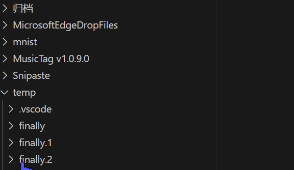
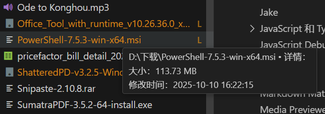
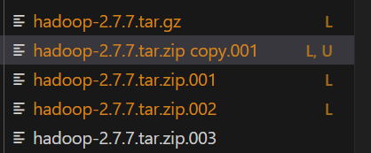
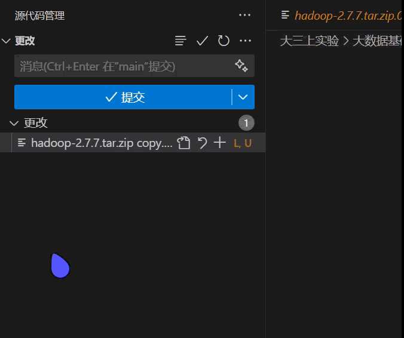
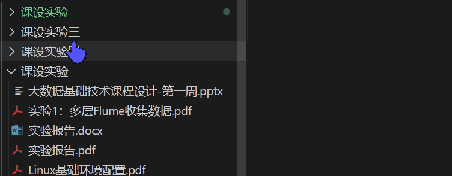

# 文件树增强

一个轻量级、高性能的 VS Code 资源管理器树增强扩展，在悬浮时显示文件和文件夹的详细信息，如大小、子文件数、子文件夹数等。

> 必读：**第一次安装后，请重启 VS Code**。这是由于本扩展做了本地化处理，重启一次 VS Code 可以保证各个受支持的语言被正确地加载。目前支持的语言列表：英文（en）、简体中文（zh-cn）。下方动图中的所有效果都做了多语言适配，重启后，即可看到正确的语言显示效果。如中文的“大小”字段，英文会显示为“Size”。

## 功能演示

- 文件大小显示：悬浮在文件上时，显示文件的大小，支持所有文件类型。
  

- 文件夹详情显示：悬浮在文件夹上时，显示文件夹的总大小、包含的文件数量和子文件夹数量。
  

- 媒体文件元信息展示：对于媒体文件做了特殊优化，可以读取其元信息，如图片的分辨率（当前版本只支持图片，日后会逐渐加入更多媒体文件类型）。
  

- 大文件标注：对于大文件，会用类似 Git 扩展的样式进行标识（追加一个 L 标志，可以和 Git 标志共存），方便用户识别，和 Git 的集成性非常好。假如您的工作区是 Git 仓库，这将有效提示用户，避免误提交大文件。纵使您不使用 Git 仓库，该标识也有助于您识别大文件。
  

  

  

  请注意和 Git “U” 标志共存的 “L” 标志。

## 配置选项

您可以在 VS Code 的设置中搜索 `tree-enhancer` 来定位到本扩展的配置选项。本扩展的配置选项说明详尽而清晰，您可以根据需要进行调整。配置选项完整支持本地化，您可以在不同语言环境下看到相应语言的配置说明。

## 已知问题

- 当存在某些提示时，例如文件夹下的代码中有错误，这会导致文件夹提示“包含强调项”。该提示有很高的优先级，会导致其他提示失效果。目前尚无法解决该问题。“包含强调项”被解决后，本扩展的提示将恢复正常。
  

## 贡献及本地化

如何国际化或本地化？您可以复制 `package.nls.json` 文件，增加您国家/地区地语言文件，如 `package.nls.zh-cn.json`，将键值对中的值翻译为您的语言，并提交 issue 或 PR。

## 开发者信息

蛋卷儿（EggRoll）

博客：<https://eggroll.pages.dev>
