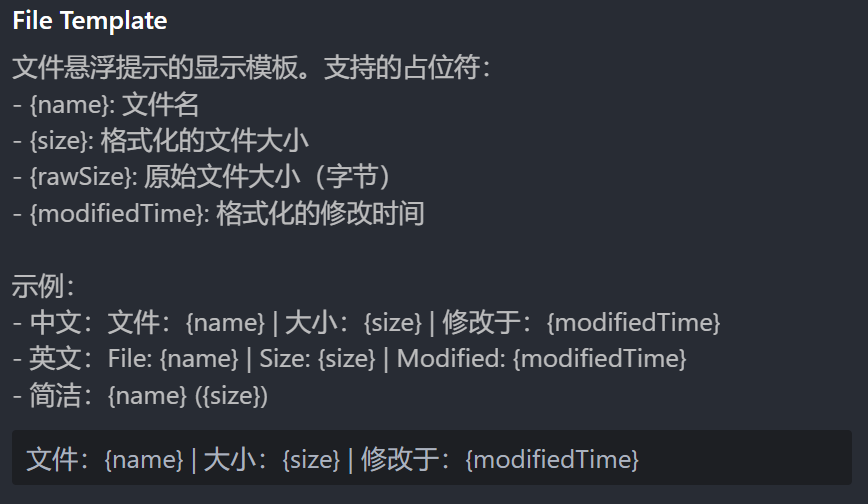
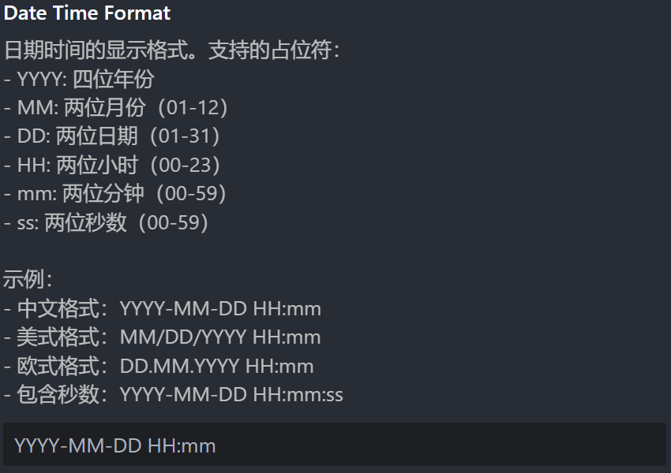

# 文件树增强

> 重大版本升级期，暂使用纯中文开发，提高效率，之后补全国际化模板。

一个增强 VS Code 资源管理器的扩展，在悬浮时显示文件和文件夹的详细信息，如大小、子文件数、子文件夹数等。


## 重大升级

现已支持自定义悬浮时显示的信息模板，也可以调整日期的格式，几乎全部设置增加了本地化功能（参见“贡献”）。请在 Tree Enhancer 的设置中查看相关配置项。





## 已知问题

- 当存在某些提示时，例如文件夹下的代码中有错误，这会导致文件夹提示“包含强调项”。该提示似乎有很高的优先级，会导致其他提示失效，包括 Git 状态和本扩展的提示。目前尚无法解决该问题。“包含强调项”被解决后，本扩展的提示将恢复正常。


- 高权限文件夹无法计算，这是预期之内的。
- VS Code 的文件管理器似乎具有某种类似于缓存的机制，这有时会导致修改时间计算不准，这在 VS Code 自带的以“modified”排序文件的功能中似乎也存在，尚未定位问题的源头。

## 主要功能

### 智能文件夹信息

- **递归计算大小**：自动统计文件夹内所有文件的总大小
- **文件统计**：显示文件夹内的文件数量和子文件夹数量
- **实时计算**：每次悬浮都重新计算，确保信息准确性
- **超时保护**：可配置计算时间限制，避免长时间等待

### 详细文件信息

- **文件大小**：以易读格式显示文件大小
- **修改时间**：显示文件最后修改时间
- **图片分辨率**：对于支持的图片文件（jpg, jpeg, png, gif, webp, svg），显示宽度和高度信息
- **格式化显示**：中文友好的日期时间格式

### 灵活的配置

- **单位基底切换**：支持 1000（KB / MB / GB）和 1024（KiB / MiB / GiB）两种计算方式
- **超时设置**：可调节文件夹计算的最大等待时间（1 - 60秒）
- **调试模式**：开发者友好的详细日志输出

## 效果演示


悬浮在文件夹上显示大小、文件数量、修改时间等信息↑


悬浮在文件上显示大小和修改时间↑


与其他扩展的悬浮提示良好兼容↑

## 安装使用

1. 在 VS Code 扩展市场搜索“Tree Enhancer”
2. 点击安装并重启 VS Code
3. 将鼠标悬浮在资源管理器中的文件或文件夹上即可查看详细信息

## 扩展设置

本扩展提供以下配置选项：

- `eggroll-tree-enhancer.maxCalculationTime`: 文件夹大小计算的最大等待时间（毫秒），默认 5000ms，范围 1000-60000 ms
- `eggroll-tree-enhancer.fileSizeBase`: 文件大小计算基底，可选 1000（十进制）或 1024（二进制），默认 1000
- `eggroll-tree-enhancer.debugMode`: 启用调试模式，输出详细日志，默认关闭
- `eggroll-tree-enhancer.imageResolutionTemplate`: 图片分辨率信息显示模板，默认为"分辨率：{width}（宽） * {height}（高）"

### 配置示例

```json
{
    "eggroll-tree-enhancer.maxCalculationTime": 10000,
    "eggroll-tree-enhancer.fileSizeBase": 1024,
    "eggroll-tree-enhancer.debugMode": false,
    "eggroll-tree-enhancer.imageResolutionTemplate": "分辨率：{width}（宽） * {height}（高）"
}
```

## 使用技巧

- **大文件夹优化**：对于包含大量文件的文件夹，可以适当增加 `maxCalculationTime` 设置
- **单位偏好**：习惯传统计算机单位的用户可以将 `fileSizeBase` 设置为 1024
- **问题诊断**：遇到问题时可以临时开启 `debugMode` 查看详细日志

## 贡献

如何国际化？您可以复制 `package.nls.json` 文件，增加您国家/地区地语言文件，如 `package.nls.zh-cn.json`，将键值对中的值翻译为您的语言，并提交 issue 或 PR。

## 开发者信息

蛋卷儿（EggRoll）

博客：<https://eggroll.pages.dev>

**祝你使用愉快！** 🎉
