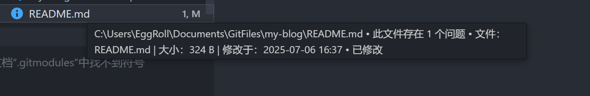

# Tree Enhancer

🌲 一个增强 VS Code 资源管理器的扩展，在悬浮时显示文件和文件夹的详细信息。

## ✨ 主要功能

### 📁 智能文件夹信息

- **递归计算大小**：自动统计文件夹内所有文件的总大小
- **文件统计**：显示文件夹内的文件数量和子文件夹数量
- **实时计算**：每次悬浮都重新计算，确保信息准确性
- **超时保护**：可配置计算时间限制，避免长时间等待

### 📄 详细文件信息

- **文件大小**：以易读格式显示文件大小
- **修改时间**：显示文件最后修改时间
- **格式化显示**：中文友好的日期时间格式

### ⚙️ 灵活配置

- **单位基底切换**：支持 1000（KB /MB /GB）和 1024（KiB /MiB /GiB）两种计算方式
- **超时设置**：可调节文件夹计算的最大等待时间（1 - 60秒）
- **调试模式**：开发者友好的详细日志输出

## 📸 效果演示


悬浮在文件夹上显示大小、文件数量、修改时间等信息


悬浮在文件上显示大小和修改时间



与其他扩展的悬浮提示良好兼容

## 🚀 安装使用

1. 在 VS Code 扩展市场搜索 "Tree Enhancer"
2. 点击安装并重启 VS Code
3. 将鼠标悬浮在资源管理器中的文件或文件夹上即可查看详细信息

## ⚙️ 扩展设置

本扩展提供以下配置选项：

- `eggroll-tree-enhancer.maxCalculationTime`: 文件夹大小计算的最大等待时间（毫秒），默认 5000ms，范围 1000-60000 ms
- `eggroll-tree-enhancer.fileSizeBase`: 文件大小计算基底，可选 1000（十进制）或 1024（二进制），默认 1000
- `eggroll-tree-enhancer.debugMode`: 启用调试模式，输出详细日志，默认关闭

### 配置示例

```json
{
    "eggroll-tree-enhancer.maxCalculationTime": 10000,
    "eggroll-tree-enhancer.fileSizeBase": 1024,
    "eggroll-tree-enhancer.debugMode": false
}
```

## 💡 使用技巧

- **大文件夹优化**：对于包含大量文件的文件夹，可以适当增加 `maxCalculationTime` 设置
- **单位偏好**：习惯传统计算机单位的用户可以将 `fileSizeBase` 设置为 1024
- **问题诊断**：遇到问题时可以临时开启 `debugMode` 查看详细日志

## 🐛 已知问题

- 在某些情况下，当文件具有 Git 状态变化时，可能与 Git 扩展的悬浮提示产生冲突
- 对于权限受限的系统文件夹，可能无法正确计算大小

## 📝 更新日志

### 1.0.0

- 🎉 初始版本发布
- ✨ 支持文件和文件夹信息悬浮显示
- ⚙️ 可配置的计算基底和超时设置
- 🔧 调试模式支持

## 📋 系统要求

- 对 VS Code 理论上没有特定版本要求
- 适用于 Windows、macOS 和 Linux

## 🤝 贡献

欢迎提交 Issue 和 Pull Request！

## 🙏 致谢

感谢 VS Code 团队提供强大的扩展 API！

---

## 🔧 开发者信息

本扩展遵循 VS Code 扩展开发最佳实践：

- [扩展开发指南](https://code.visualstudio.com/api/references/extension-guidelines)

**祝你使用愉快！** 🎉
